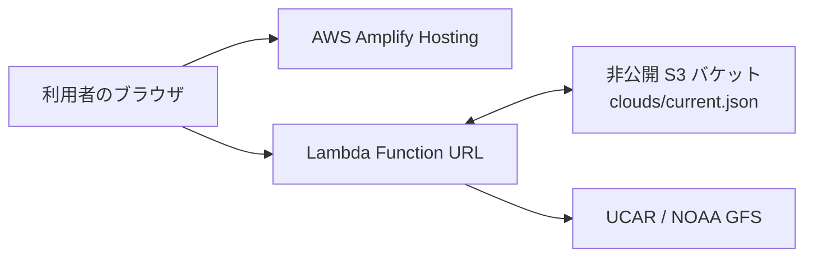

# orbital — Interactive dot globe

Canvas 2D で描く、ドラッグ操作に対応したドット地球儀

## 起動

Node.js 20.19 以上の 20 系、または 22.12 以上を使用してください。

```sh
npm install
npm run dev
```

`npm run dev` の開始前に、外部気象APIを利用して雲の分布を取得するため、ネットワーク接続が必要。取得が終わると開発サーバーが起動する (表示中に雲データを自動更新することはない)。

## 仕組み

1. Natural Earth II の世界地図を 1,440 × 720 ピクセルの正距円筒図法の画像として同梱しています。画像の横方向が経度、縦方向が緯度に対応します。
2. 画面の円形領域に、上下左右に頂点を持つひし形ドットを並べます。45度傾けた正方格子に配置し、従来の約2倍の密度にしています。それぞれの中心座標と中心から頂点までの距離（`dotRadius`）を保持し、配置を作り直すのは表示サイズが変わったときだけです。回転中に位置・大きさ・形の向きを変えることはありません。
3. 各ドットの画面座標を球の半径で正規化し、`z = sqrt(1 - x² - y²)` で手前の球面上の位置を求めます。画面の下向きの Y 座標は、球面上では上向きに変換します。
4. 球面上の位置に現在の向きの逆回転を適用し、地球に固定された座標を得ます。`lat = asin(y)`、`lon = atan2(x, z)` で緯度・経度を求め、対応する地図画像の色を各ドットに表示します。地球の向きが変わると、同じドットが参照する緯度・経度と色が変わります。
5. 初期状態とリセット時には、地球儀の初期姿勢で回転させた北極方向を自動回転の軸に設定します。これにより、表示に12度の傾きがあっても、自動回転中の北極・南極の位置が一定になります。ドラッグ中は `回転角 = ポインターの移動距離 / 表示半径` とし、移動を直接反映します。自動回転中は `回転角 = 設定速度 × 経過時間` です。
6. 終了時は最後の移動ベクトルを正規化して回転軸を保持するため、斜めのドラッグでも自動回転の速さは同じです。ポインターキャプチャにより、キャンバスの外で離しても操作を終了します。

雲も同じ緯度・経度から分布を読み取り、青白い色（RGB 205, 225, 245）を最大60%の不透明度で地表色に重ねます。雲量100%でも地表色を40%以上残すため、海・植生・砂漠の違いが見えます。雲を表示しても、ドットの位置・大きさ・形の向きは変わりません。

初回表示では、初期回転軸から求めた画面上の回転方向（初期状態は左から右）へ、地球儀と同じ角速度でドットを順にフェードインさせます。実際に回転した角度だけ出現境界を進めるため、速度変更・一時停止・タブ非表示からの復帰でも回転と同期します。標準速度では半回転に約11秒、最後のフェードを含めて約11秒で全体が現れます。ドットは移動・拡大させず、不透明度だけを変えます。ドラッグ・矢印キー・リセットで直接操作を始めると演出を完了し、再実行しません。雲・経緯線の切り替えでは演出を継続します。モーション軽減設定が有効な場合は演出を省略します。

Canvas 自体は 2D です。WebGL、Three.js、外部地図 API、API キーは不要です。地図は配信サイト内のファイルから読み込みます。雲は設定時のみAWS Lambdaの公開APIから読み込み、未設定または障害時には配信サイト内の予備データを使います。フォントのみ Google Fonts を使用し、取得できない場合はシステムフォントに切り替わります。

## 雲データ

NOAA GFS の全球の総雲量を、UCAR の公開 THREDDS NCSS 経由で取得します。気象モデルによる推定値であり、衛星のリアルタイム観測画像ではありません。画面にはデータの対象日時と出典を表示します。

通常の `npm run dev` と `npm run build` は気象サービスへアクセスしません。`public/data/clouds.json` は、Lambda APIが利用できないときだけ使う予備データです。

AWSでアクセス時更新を有効にするには、Lambda Function URLを `VITE_CLOUD_API_URL` に設定してビルドします。ブラウザーはページを開くたびにこのURLを呼び、LambdaがS3内の `clouds/current.json` の `fetchedAt` を検査します。標準設定では1時間以内なら保存済みJSONを返し、期限切れならUCAR/NOAA GFSから取得・検証してからS3を更新します。更新に失敗した場合は直前の有効なS3データを返し、画面に「前回取得データ」と表示します。S3にもAPIにも到達できないときは、同梱の予備データを使います。

手動で雲データを更新する場合は、次のコマンドを使います。

```sh
npm run fetch:clouds
```

開発中に予備データを更新する場合は、保存後にページを再読み込みしてください。静的サイトへ反映するには再ビルドと再配置が必要です。

手動更新スクリプトが失敗した場合は非ゼロの終了コードを返し、前回正常に保存できたデータを保持します。ブラウザーでAPIと予備データの両方を読み込めない場合は、雲を非表示にして警告を表示し、「雲を表示」を無効にします。地球儀の回転や地表の表示は引き続き利用できます。

保存形式は `version: 1` の JSON です。`width` と `height` は格子の大きさ、`values` は各地点の雲量（0〜1、欠測は `null`）を表します。`observedAt` はモデルの対象時刻、`fetchedAt` は取得時刻、任意の `modelRunAt` はモデルの実行時刻です。`observedAt` というフィールド名は実測を意味しません。`source` には `name`、`url`、`kind: "forecast"`、`attribution` を記録します。

## ファイル

| ファイル                          | 内容                                                     |
| --------------------------------- | -------------------------------------------------------- |
| `src/main.js`                     | ドラッグ・タッチ・キーボード、設定 UI、描画ループ        |
| `src/motion.js`                   | 描画に依存しない回転計算と方向の保持                     |
| `src/renderer.js`                 | 地球の逆回転、固定ドットへの色の適用、Canvas 2D への描画 |
| `src/surface.js`                  | 固定ドットの配置、球面への逆投影、地図の色の補間         |
| `src/clouds.js`                   | 雲データの検証、雲量の参照                               |
| `src/reveal.js`                   | 初回だけの、回転方向に沿った出現演出                     |
| `src/style.css`                   | デスクトップ・モバイルの画面デザイン                     |
| `public/data/surface-map.png`     | 地表の色を参照する世界地図画像                           |
| `public/data/clouds.json`         | 取得時点で保存した雲の分布と対象日時                     |
| `public/data/README.md`           | 地図の出典、ライセンス、生成方法                         |
| `scripts/generate-surface-map.py` | 世界地図画像の再生成                                     |
| `scripts/fetch-clouds.mjs`        | 公開気象モデルから雲データを取得・保存                   |
| `lambda/index.mjs`                | S3キャッシュと気象APIを扱うLambda Function URLハンドラー |
| `lambda/package.json`             | Lambda ZIPに同梱する依存関係                             |
| `scripts/package-lambda.ps1`      | WindowsでLambda用ZIPを生成するスクリプト                 |

## ビルドと検証

```sh
npm run build        # 外部気象APIにアクセスせず、dist/ に静的サイトを出力
npm run preview      # ビルド結果をローカルで確認
npm test             # 回転計算・描画のユニットテスト
npm run test:browser # Chrome でブラウザー操作を検証
npm run package:lambda # artifacts/lambda/ にLambda用ZIPを出力（Windows）
```

ブラウザーテストには Google Chrome が必要です。未インストールの環境では `npx playwright install chrome` で導入できます。回転前後のドットの位置・半径の固定、地表の色の変化に加え、ドラッグ方向、終了後の回転、一時停止、設定、キーボード、タッチ、モーション軽減を確認します。

地図画像は同梱済みなので、通常の起動やビルドに再生成は不要です。再生成する場合は Python と Pillow を用意し、次のコマンドを実行します。元データの取得にはネットワーク接続が必要です。

```sh
python -m pip install Pillow
python scripts/generate-surface-map.py
```

Windows で `python` が使えない場合は、インストール済みの Python に対応する `py` コマンドを使用してください。詳しくは [地図データの説明](public/data/README.md) を参照してください。

## 地図の出典

[Natural Earth](https://www.naturalearthdata.com/) の Natural Earth II ラスター画像を使用しています。
地図データは [Public Domain](https://www.naturalearthdata.com/about/terms-of-use/) です。詳細は [public/data/README.md](public/data/README.md) を参照してください。
解像度の小さい地図を点で表現しているため、非常に小さい島は省略される場合があります。


## デプロイ構成



アクセス時は以下の処理

1. ブラウザが地球儀画面をAWS Amplifyから取得
2. ブラウザがLambda Function URLを呼ぶ
3. LambdaがS3の `fetchedAt` を確認する
4. 例えば1時間以内なら、そのJSONを即座に返す
5. 期限切れならUCAR/NOAA GFSから取得・検証し、成功時だけS3のJSONを置き換えて返す
6. 気象APIが失敗した場合は最後に成功したJSONを返し、画面では対象時刻と「前回取得データ」を示す


## AWS 本番構成

- リージョン: `ap-northeast-1`
- 静的サイト: AWS Amplify Hosting
- 雲API: Lambda Function URL
- 雲キャッシュ: 非公開S3バケット `<cloud-cache-bucket>`
- 気象データ: UCAR THREDDS 経由の NOAA GFS 総雲量
- キャッシュ期間: 3,600秒（1時間）

### Lambda

- 関数名: `interactive-dot-globe-cloud-api`
- ランタイム: Node.js
- メモリ: 512MB
- タイムアウト: 45秒
- ハンドラー: `lambda/index.handler`
- VPC: 使用しない
<!--
- 同時実行数: 5
-->

Lambda環境変数:

| 変数 | 値 |
| --- | --- |
| `CLOUD_BUCKET` | `<cloud-cache-bucket>` |
| `CLOUD_KEY` | `clouds/current.json` |
| `CACHE_TTL_SECONDS` | `3600` |
| `WEATHER_TIMEOUT_MS` | `40000` |

Lambda実行ロールは、`clouds/current.json` に対する
`s3:GetObject` と `s3:PutObject` のみを許可する。

### 雲データの動作

1. ページ表示時、ブラウザがLambda Function URLへGETする。
2. LambdaはS3キャッシュを確認する。
3. 1時間以内ならキャッシュを返す。
4. 期限切れならGFSから取得・検証してS3を更新する。
5. 更新失敗時は前回正常なデータを返す。
6. LambdaとS3の両方が利用できない場合、ブラウザは同梱の予備データを使う。

### デプロイ手順

1. `npm ci`
2. `npm test`
3. `npm run build`
4. `npm run package:lambda`
5. `artifacts/lambda/interactive-dot-globe-cloud-api.zip` をLambdaへアップロード
6. Amplifyで `VITE_CLOUD_API_URL` にFunction URLを設定して再デプロイ
7. Lambda Function URLのCORS許可元にAmplify本番URLを設定する